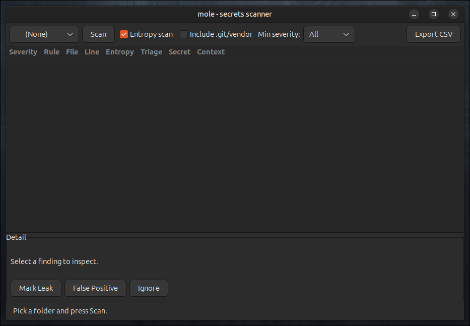

# mole — Secrets Scanner (CLI + GTK3)


`mole` recursively walks a directory tree and greps every text file for leaked
credentials — API keys, private keys, JWTs, AWS/GCP tokens — using a
combination of **regex signatures** and **Shannon-entropy** analysis. It ships
as a fast command-line scanner and a GTK3 triage UI.



> _Drop a `screenshot.png` next to this README and it will render here._

It reuses two pieces of the surrounding toolkit:

- the **entropy math** from the `entropy` password tool (`shannon_entropy_bits`,
  `charset_pool`, naive `length × log2(pool)`), and
- the **recursive directory walker** from `syshash` (`lstat`-based, never
  follows symlinks), adapted to hand each file to a content grep instead of a
  hash.

---

## How it detects secrets

Each line is run through two detectors and the results are de-duplicated so a
single secret yields a single finding (the most specific / highest-severity
match wins):

1. **Signature rules** — POSIX extended regexes for well-known credential
   formats:

   | Rule | Severity |
   |------|----------|
   | AWS Access Key ID (`AKIA…`) | HIGH |
   | AWS Secret Access Key | CRITICAL |
   | GCP API Key (`AIza…`) | HIGH |
   | Google OAuth token (`ya29.…`) | HIGH |
   | GitHub token (`ghp_/gho_/…`) | HIGH |
   | Slack token (`xox…`) | HIGH |
   | Stripe secret key (`sk_live_…`) | CRITICAL |
   | Twilio / SendGrid keys | HIGH |
   | JSON Web Token (`eyJ….eyJ….…`) | MEDIUM |
   | PEM private key block | CRITICAL |
   | Generic secret assignment (entropy-gated) | MEDIUM |

   The **generic assignment** rule captures the value assigned to a
   sensitive-looking name (`password`, `api_key`, `token`, …) and only fires
   when that value's observed Shannon entropy clears a threshold — so
   `password = changeme` is ignored while a random blob is caught.

2. **Standalone entropy scan** — tokenises each line into base64/hex-like runs
   and flags any of length 20–100 whose Shannon entropy exceeds the threshold
   (default **4.3 bits/char**). Catches high-entropy secrets that match no known
   signature.

Secrets are always **redacted** before display (`AKIA************MPLE`).

By default the walk skips VCS and dependency directories (`.git`,
`node_modules`, `vendor`, `__pycache__`, …) and binary files, and caps file
size at 8 MiB.

---

## Build

Requires a C compiler, `make`, `pkg-config`, and the **GTK 3** development
headers (for the GUI). On Debian/Ubuntu:

```bash
sudo apt install build-essential pkg-config libgtk-3-dev
```

```bash
make            # builds CLI (mole) and GUI (mole-gui)
make cli        # CLI only — no GTK needed
make gui        # GUI only
```

---

## Command-line usage

```bash
./mole [options] [PATH]        # PATH defaults to the current directory
```

A single file may be passed instead of a directory.

| Option | Meaning |
|--------|---------|
| `-e, --min-entropy N` | Shannon bits/char gate for generic matches |
| `-t, --entropy-thresh N` | threshold for the standalone entropy scan (default 4.3) |
| `-E, --no-entropy` | disable the standalone high-entropy scan |
| `-a, --all` | do **not** skip VCS/vendor directories |
| `-H, --skip-hidden` | skip dot-files and dot-directories |
| `-s, --severity LEVEL` | only report at/above `low\|medium\|high\|critical` |
| `--no-color` | disable coloured output |
| `-h, --help` / `-v, --version` | help / version |

**Exit status:** `0` clean, `1` findings reported, `2` error — convenient for
CI gating:

```bash
mole -s high . || echo "secrets found!"
```

Example:

```text
CRITICAL config.yml:2
    rule    : AWS Secret Access Key
    secret  : wJal********************************EKEY  (entropy 4.66 bits/char)
    context : aws_secret_access_key: wJalrXUtnFEMI/K7MDENG/bPxRfiCYEXAMPLEKEY
```

---

## GUI usage

```bash
./mole-gui [PATH]      # optional PATH is pre-loaded and scanned on launch
```

- Pick a folder, toggle **Entropy scan** / **Include .git/vendor**, press
  **Scan** (runs on a worker thread; the window stays responsive).
- Findings appear in a sortable, **severity-coloured** table; the **Min
  severity** filter narrows the view.
- Select a row to see details, then triage it as **Leak**, **False Positive**,
  or **Ignore**.
- **Export CSV** writes the current findings (with triage state) to a file.

---

## Install

```bash
sudo make install      # binaries + icon + desktop entry
sudo make uninstall
```

Installs `mole` and `mole-gui` to `/usr/local/bin`, plus an icon and a desktop
launcher ("mole — Secrets Scanner").

---

## Project layout

```
src/entropy.{c,h}   Shannon entropy + charset pool (from `entropy`)
src/walk.{c,h}      recursive lstat-based walker (from `syshash`)
src/rules.{c,h}     regex signature table
src/scan.{c,h}      per-line detection, dedup, findings list
src/main.c          CLI front-end
src/gui.c           GTK3 triage UI
```

Author: Jean-Francois Lachance-Caumartin

---

## License

MIT © 2026 Jean-Francois Lachance-Caumartin
